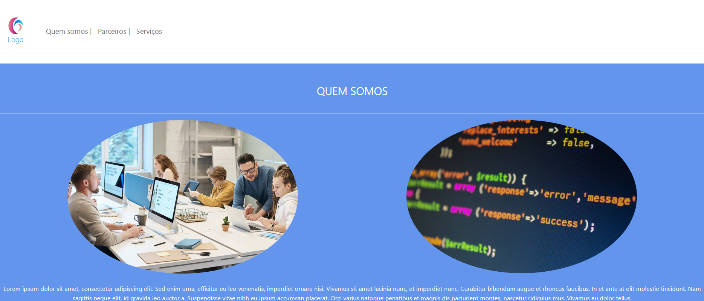
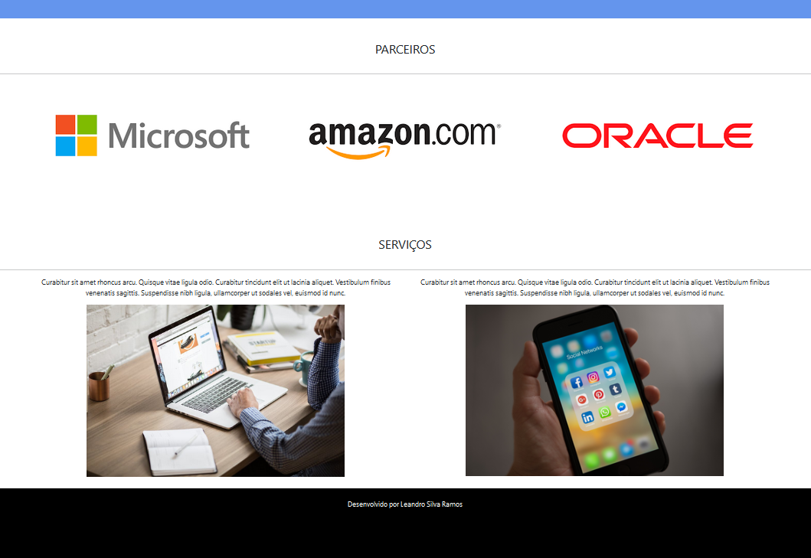

An introduction course powered by Digital Innovation One (DIO) to explain how to use a Bootstrap framework to **build a responsive HTML5 / CSS3 webpage** in a better presents in desktop and mobile devices .

This exercise use the following resources of bootstrap:

* **navbar** class to navigate inside the webpage.

* **rounded-circle** to show rounded images.

* **container-fluid** for a better presentation of div elements in pages getting all size width of the page.

* **container**, **row** and **col-lg** to make a structure separated by colums using div tags.

  

---------------------------------

Um curso de introdução desenvolvido pela Digital Innovation One (DIO) para explicar como usar o framework Bootstrap para **construir uma página web HTML5 / CSS3 responsiva** com uma melhor apresentação em desktops e dispositivos móveis. 

Este exercício usa os seguintes recursos de bootstrap: 

* Classe **navbar** para navegar dentro da página web. 

* **rounded-circle** para mostrar imagens arredondadas. 

* **container-fluid** para uma melhor apresentação dos elementos div nas páginas, obtendo toda a largura de tamanho da página.  

* **container**, **row** e **col-lg** para fazer uma estrutura separada por colunas usando tags div.

  

-----------------------------

<h1 align="center">
	
</h1>

<h1 align="center">
	
</h1>

